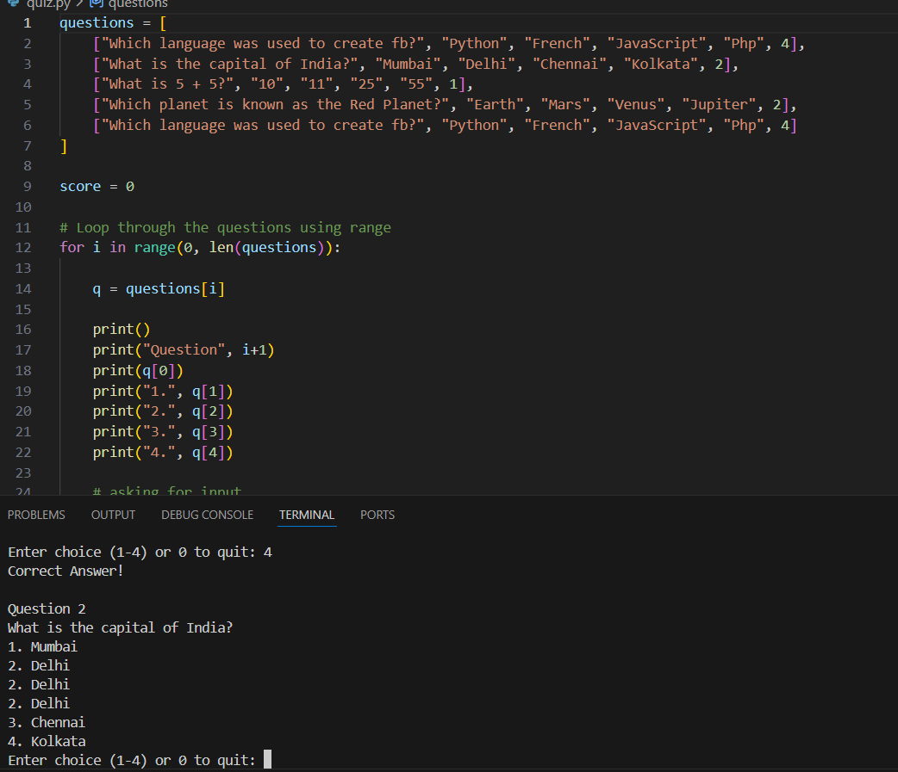

# Python Quiz Game

## Overview
A simple, interactive command-line quiz game built with Python. The player answers a series of multiple-choice questions to earn points. The game features a "sudden death" mechanic where one wrong answer ends the game, and it tracks the final score.

## Features
* **Multiple Choice Questions:** Users select answers from for options.
* **Score Tracking:** Earn 10 points for every correct answer.
* **Sudden Death:** The game loops through questions but ends immediately if a wrong answer is given.
* **Quit Option:** Players can exit the game at any time by pressing `0`.
* **Input Validation:** Accepts integer inputs for game choices.

## Technologies Used
* **Language:** Python 3.8
* **Libraries:** Standard Python libraries only.

## Installation & Run
There is no need to install any libraries or functions.

1.  **Prerequisites**
    Make sure you have Python installed on your machine. You can check this by typing:
    ```bash
    python --version
    ```

2.  **Clone or Download**
    Download the `quiz.py` file to your local machine.

3.  **Run the Game**
    Open your terminal (Command Prompt on Windows, Terminal on Mac/Linux), navigate to the folder containing the file, and run:
    ```bash
    python quiz.py
    ```

## Instructions for Testing
To manually test that the game is working correctly:

1.  **Test Correct Answer:**
    * Run the game.
    * On Question 1 ("Which language was used to create fb?"), type `4` and press Enter.
    * *Expected Result:* The game prints "Correct Answer!" and moves to Question 2.

2.  **Test Wrong Answer:**
    * Start the game.
    * On any question, enter a wrong number (e.g., `1`).
    * *Expected Result:* The game prints "Wrong Answer!", displays the "Final Score," and the program stops.

3.  **Test Quit Function:**
    * Start the game.
    * Type `0` and press Enter.
    * *Expected Result:* The game prints "Quitting game" and stops immediately.

## Screenshots


## Recordings
